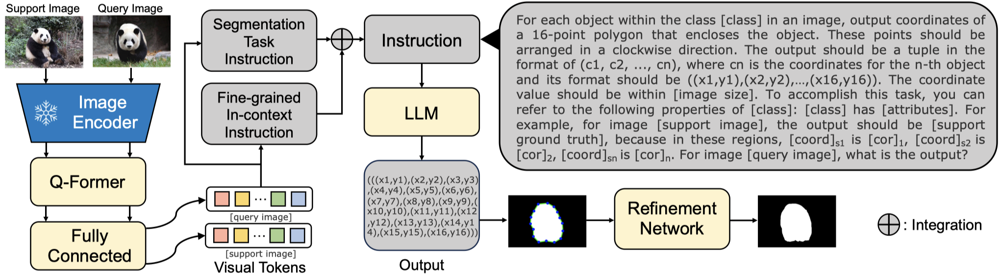

# LLaFS: When Large-Language Models Meet Few-Shot Segmentation
We propose LLaFS, the first attempt to leverage large language models (LLMs) in few-shot segmentation.

This paper is under submission. We will release the code after paper acceptance. 

If you have any question, please feel free to contact the author by Lanyun_zhu@mymail.sutd.edu.sg.
